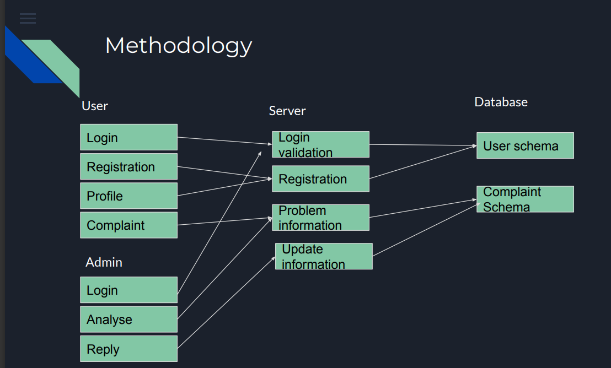
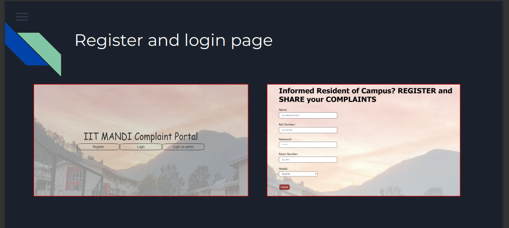
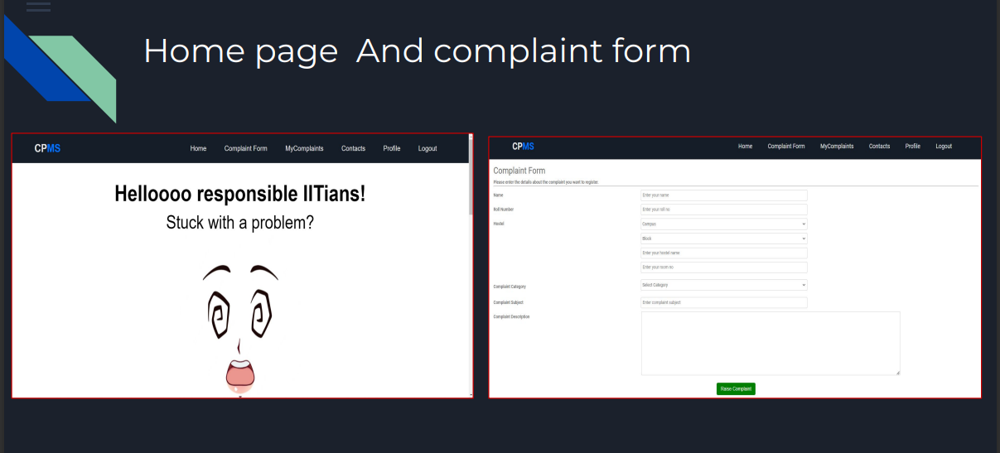
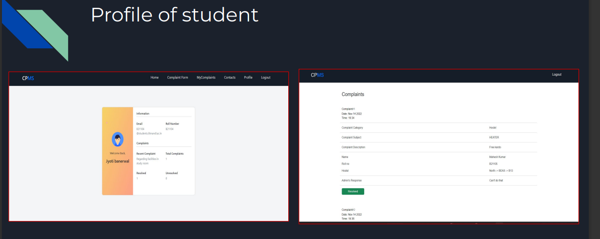
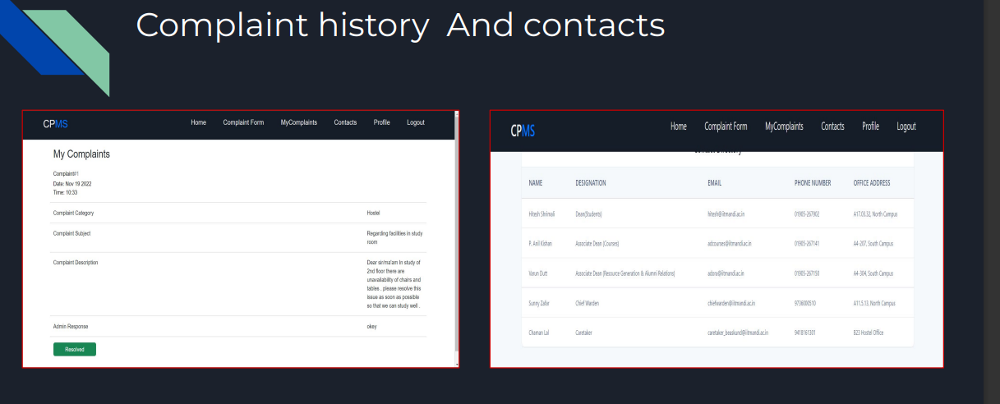

# Complaint Management Portal

## Table of Contents
- [Introduction](#introduction)
- [Features](#features)
- [Technologies Used](#technologies-used)
- [Installation](#installation)
- [Usage](#usage)
- [Screenshots](#screenshots)
- [Contributing](#contributing)

## INTRODUCTION  
The Complaint Management Portal is a full-stack web application designed to facilitate the efficient handling of complaints and communication between users and administrators. It offers a user-friendly interface for users to register, submit complaints, and track the status of their complaints. Administrators have access to a separate dashboard for managing complaints, users, and communication.

## Features

- User Authentication and Authorization
- User Registration Form
- Complaint Submission Form
- User Profile Page
- Admin Dashboard with Different Access Levels
- Complaint Tracking
- Contact Information Form for Communication
- NodeMailer Integration for Email Notifications
- MongoDB Databases for Users, Admins, and Complaints
- Admins Can Update Complaint Status

## Technologies Used

- HTML
- CSS
- Express.js
- MongoDB
- Node.js
- NodeMailer

## Installation

1. Clone the repository to your local machine:

   ```bash
   git clone https://github.com/yourusername/complaint-management-portal.git
   
2. Navigate to the project directory:
  cd complaint-management-portal
  
3. Install the dependencies:
  npm install
  
4. Set up your MongoDB database and configure the connection in the .env file:
    MONGODB_URI=your_mongodb_uri
   
5. Start the application:
    npm start

## Usage

- Users can register, log in, and submit complaints via the web interface.
- Admins can log in to their dashboard to manage complaints, users, and update complaint statuses.
- The NodeMailer integration sends email notifications to users and admins for important updates.

  
## Screenshots

- 
- 
- 
- 
- 

## Contributing
If you'd like to contribute to this project, please follow these steps:

- Fork the repository on GitHub.
- Create a new branch for your feature: git checkout -b feature-name.
- Commit your changes: git commit -m 'Add new feature'.
- Push your branch: git push origin feature-name.
- Submit a pull request to the main branch.
